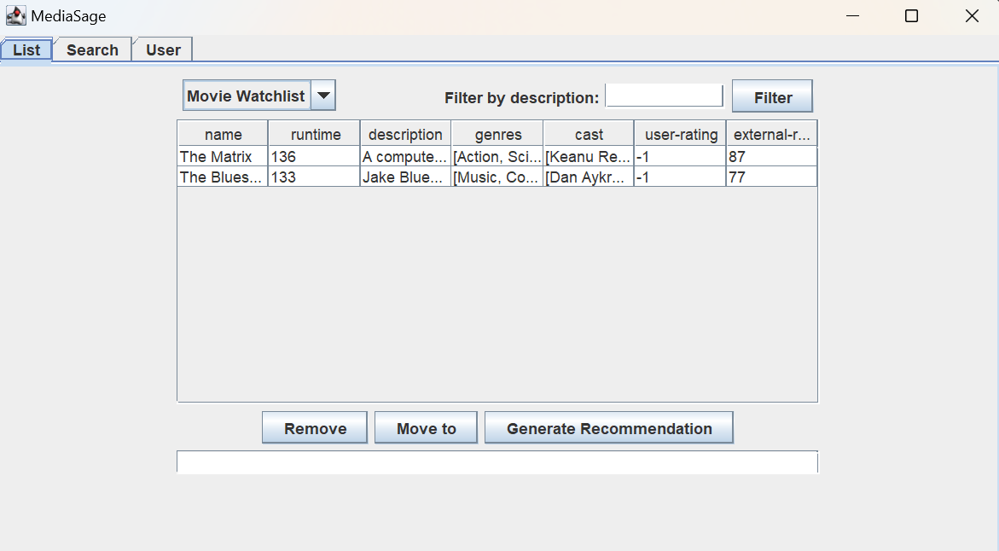

# MediaSage
CSC207 Fall 2024, Group # 74. 
 
A mixed-media tool for finding, rating, and saving different pieces of media.

## Table of contents
[Introduction](#mediasage)

[Installation](#configuration)

[Contributors](#contributors)

[Project Details](#project-details)

[Feedback](#feedback)

[Contributing to the project](#contributing)

## Project Details
This project allows user to add, rate and get recommendation for contents they enjoy, such as movies, televisions, 
and eventually more types of other media.

This project aims to be a useful tool to help users keep track of all the different media 
they've enjoyed across different medium in one single place, and ways for them to discover more content
they might also like based on their interests.

It was made as part of a course project for us, but we hope it can develop into something more helpful for 
the average user as well.

## Project Features

## Configuration
Navigate to `src/main/resources/input_apikeys.yaml`, make a copy of the file as `apikeys.yaml`,
then input the respective API keys.

## Feedback
// TODO

## Contributing
If you have any code contributions, feel free to fork the project in the top right corner of the page, 
commit the relevant changes, and submit a pull request. 
The pull request should contain reasons for the pull request, what features it adds, and any potential issues not addressed
in the pull request.

We will review the code for functionality and style, provide specific feedback and eventually merge it if it's 
evaluated to fit our project's scope and goals.

## Contributors
- Sophie Miki Erenberg ([sophie-erenberg](https://github.com/sophie-erenberg/))
- Simon Bocoun ([sbocoun](https://github.com/sbocoun))
- Xiao Lan (Judy) Chen ([Leo081](https://github.com/Leo081))
- Yizhe (Sera) Zhao ([papertots](https://github.com/papertots))

## Assigned Use Cases:
- Sophie - filter list by criteria
- Simon - search by criteria
- Judy - Move media to another list
- Sera - Change movie user rating in the user list.
